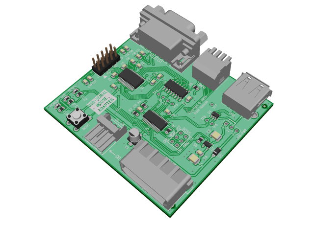
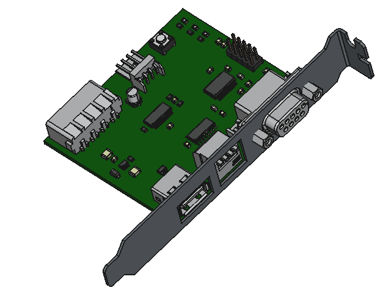

# USB-to-Serial Mouse Converter

This is an adapter to convert a USB mouse to work with an RS-232 serial interface. Gives the capability to use a modern USB optical mouse with vintage PC computer hardware, where original serial ball mice are frequently scarce, unreliable, or just unpleasant to use.

Designed to be mounted with a bracket internally in a regular PC expansion card chassis slot.

## Features

* Emulates four different serial mouse types:
  * Microsoft 2-button
  * Mouse Systems 3-button
  * Logitech 3-button
  * Microsoft 3-button wheel
* Supports virtually any USB HID pointing device – mouse, trackball, touchpad – including scroll wheel, wireless, combo, and hi-DPI devices.
* Connects to host system's RS-232 serial port via either:
  * External female DE-9 connector
  * Internal male 10-pin header
* Powered by regular PC power supply connector, either larger Molex HDD-type or smaller Berg FDD-type.
* Custom bracket design for mounting in standard PC expansion card chassis slot.
* Configuration adjustable via externally-accessible DIP switches.
* USB port short-circuit and over-current protected (500 mA capable).
* Supports optional Plug-and-Play ID for auto-detection by capable operating systems (e.g. Win9x) and drivers.
* Supports subset of proprietary Logitech serial probe/identification commands for auto-detection by Logitech drivers.
* Firmware upgradable over USB.

## Installation & Setup

1. Screw the adapter board's bracket into a free chassis expansion slot.
2. Plug a spare power supply cable into **either** the larger Molex HDD-type **or** smaller Berg FDD-type power connectors. **Do not use both power connectors.**
3. Connect **either** external **or** internal serial cables, as described below.
4. Configure DIP switches according to desired usage (see *Configuration* section).

> [!NOTE]
> The adapter board does not plug into the motherboard expansion bus, so if you have a free chassis slot that doesn't have a corresponding motherboard connection, use that to avoid taking up space that could otherwise be used for a card!

### External Serial Cable

**You will require a male-to-female 9-pin DE-9 RS-232 serial cable.**

1. Connect one end of the cable to the 9-pin port on the adapter.
2. Connect the other end of the cable to a free 9-pin serial port on the host machine. Effectively, you're looping the serial cable from the machine back to itself.
3. Set port selection DIP switch to 'External' (see *Configuration* section below).

### Internal Serial Cable

**You will require a 10-pin ribbon cable with 5x2 dual-row 2.54mm (0.1") pitch female IDC connectors.**

The internal serial connection is designed to connect to an internal pin header on the motherboard or a serial expansion card of the host machine.

> [!IMPORTANT]
> The internal 10-pin header uses the 'Intel' pin-out; it is not compatible with the other common 'AT'/'Everex' pin-out.

1. Connect one end of the cable to the adapter's pin header labelled `RS232-INT`. Note the arrow indicating pin 1, which should align with the red stripe on the cable.
2. Connect the other end of the cable to the host machine's internal RS232 port header. Again, ensure the red stripe is aligned to pin 1. Be aware that pin 1 markings on motherboards and expansion cards may vary, so if not immediately apparent, inspect closely.
3. Set port selection DIP switch to 'Internal' (see *Configuration* section below).

If in doubt about host machine's serial header location, orientation, or exact pin-out, refer to your motherboard or serial expansion card's documentation.

> [!NOTE]
> You may need to alter jumpers, DIP switches, or BIOS settings to enable and configure (port address, IRQ, etc.) an internal serial port header.

### Configuration

Serial mouse emulation type, Plug-and-Play ID, and external/internal serial port selection are configured via DIP switches.

> [!IMPORTANT]
> If you change any of the switches (except the port selection switch) while the system is running, you will need to either unload and re-load the mouse driver or restart the system for changes to take effect.

Numeric column headings in the tables below correspond to the labels on the DIP switch, and the off/on values in each row are what each individual switch should be set to.

#### Serial Mouse Type

Selects what type of serial mouse to emulate.

| Serial Mouse Type        | 1   | 2   |
| ------------------------ |:---:|:---:|
| Microsoft 2-button       | OFF | OFF |
| Mouse Systems 3-button   | ON  | OFF |
| Logitech 3-button        | OFF | ON  |
| Microsoft 3-button Wheel | ON  | ON  |

Logitech emulation includes support for Logitech-proprietary probing/identification commands sent to the serial mouse, but not any others such as baud rate, protocol, or report rate switching. Logitech command support is disabled when PnP is enabled.

Microsoft Wheel support depends on both driver and application support; otherwise, wheel will be limited to acting as middle button.

#### Plug and Play ID

Whether to emit Plug and Play ('PnP') data when the host driver or operating system resets/probes the mouse (by toggling the serial RTS line), so that the mouse can be automatically identified.

| PnP ID   | 3   |
| -------- |:---:|
| Disabled | OFF |
| Enabled  | ON  |

Enable this switch when using Windows 9x (or any other O/S that supports PnP). Disable when using DOS or Windows 3.x.

This switch has no effect in Microsoft 2-button and Mouse Systems mode (i.e. always acts as if disabled) – these mice pre-date PnP, so there is no identifier for them.

#### RS-232 Port Select

Selects between the internal or external RS-232 serial ports.

| RS-232 Port | 4   |
| ----------- |:---:|
| Internal    | OFF |
| External    | ON  |

Unlike the other switches, **this switch is 'live'** – i.e. takes effect immediately.

### Other Operational Notes

There are three on-board LEDs:

* 🟢 **Power** (green) – Should illuminate whenever the board is receiving 5V power from the Molex connector.
* 🔴 **USB status and activity** (red) – Will illuminate when a USB mouse is connected and has been successfully enumerated. Will flash when USB activity is occurring. Activity should be fairly constant regardless of movement or clicking due to the regular USB polling traffic.
* 🔴 **Serial status and activity** (red) – Will illuminate when the serial RTS signal has been asserted; i.e. when a driver has enabled and probed the serial mouse. Will flash when serial data is being sent. Activity will generally only be indicated when the mouse is moved, clicked, or scrolled.

**Connecting USB devices through a USB hub is not supported.** The USB device must be directly connected to the adapter.

The USB port is over-current and short-circuit protected. Maximum allowed current draw is approximately 500mA. Should the current limit be exceeded, the USB power will be shut off and the USB status LED will go out. To recover from this state, the board must be power-cycled.

The 3-way jumper labelled `USB-PWR` is only used for facilitating firmware upgrades via the USB port and should not normally need adjustment. **It must always be in the 1-2 position during normal operation.** The other position (2-3) allows for powering the board via the USB port during firmware updates.

## Hardware

For schematic, PCB layout, and Bill of Materials (BOM), see the `Hardware` sub-folder.

Gerber files for PCB manufacturing and 3D STEP file for sheet-metal mounting bracket can all be found in the 'Releases' section of the GitHub repository.

## Firmware

For firmware source files, firmware update procedure, and build procedure, see the `Firmware` sub-folder.

You can find the latest compiled firmware in the 'Releases' section of the GitHub repository.

## Motivation

There are many existing open-source projects to adapt USB mice to a serial interface, so why yet another?

A lot of other projects are somewhat limited, flawed, or buggy. Many don't properly support all varieties of USB mice, have limited serial mouse emulation, or make mistakes or omissions in their handling of certain features. Most also do unnecessary work due to lack of understanding of the USB specification.

I decided to create this project to address many of these shortcomings.

Below I'll discuss a little on some of the more notable things I discovered while researching existing solutions.

### Simplified Boot vs. Native Report Modes

One particular flaw common to all projects found based on the Raspberry Pi Pico microcontrollers is caused by their use of the ubiquitous [Tinyusb](https://github.com/hathach/tinyusb/) library.

Out of the box, the Tinyusb library only works with USB HID mice that support 'Boot' mode. In the HID standard, Boot mode is a simplified, limited-capability mode intended for BIOSes and other system bootloaders, so that they don't have to implement the entire, complex HID specification. In Boot mode mouse reports follow a standardised, fixed report format that is limited to low resolution (8-bit) axis values and only 3 buttons.

However, some mice either do not support Boot mode at all, or when told to use Boot mode wrongly continue to report their native higher-resolution (e.g. 12- or 16-bit) data in an incompatible format.

Boot mode also does not cater to more complex devices (e.g. a combo device such as keyboard with integrated trackpad) that use Report IDs to differentiate between reports sent for each sub-function.

All this leads to Tinyusb-based projects often having limited USB device compatibility; they tend not to work with 'fancier' devices like high-DPI mice or combo devices.

### "Hey, Not So Fast!"

Another common flaw comes from an apparent lack of detailed understanding of the USB specification, particularly when combined with use of a library that abstracts away some of the details of USB devices.

When a USB device is first connected, the enumeration process involves the device sending some 'descriptor' data to the host. This descriptor data describes what class of device it is, its capabilities, etc. One part of this data that is supplied by devices such as mice and keyboards is the `bInterval` field of an Endpoint descriptor. This tells the host system how often (in milliseconds) the USB device would like to be polled for data. For example, a mouse might give a `bInterval` of 10ms; that is, it can provide updates 100 times per second.

However, when it comes to serial mice, their update rate is limited by the rate at which they can spit data across the slow serial connection. Typical serial baud rate is only 1200 baud, which if you do the math works out to (depending on protocol) between 24 to 44 possible updates per second.

This disparity between update rates causes many projects to implement some kind of aggregation scheme, where they will collect multiple more-frequent USB reports and sum the pointer movement between serial updates.

But what if I told you that is wholly unnecessary? You see, that `bInterval` value mentioned earlier is a *minimum* interval time; it's the *fastest* rate at which the USB device should be polled. There's actually nothing stopping you from polling a USB mouse at a *slower* rate! So you can simply match your USB polling rate to the fastest rate at which you can send serial updates, and the mouse just does all the aggregation for you!

### Identity Problems

Some projects do not properly implement the process of the emulated serial mouse identifying itself to the host system when the host toggles the RTS line of the serial port.

In one, when working in basic 2-button Microsoft mode, the ident value incorrectly claims to be a 3-button mouse. Another identifies as a 3-button mouse, but in update reports never actually sends the 4th protocol byte containing the state of the middle button. Lastly, another tries to identify with additional Plug-and-Play ID data, but unfortunately the data it supplies is malformed.

## Resources

Here are some links to helpful technical resources concerning USB, HID, serial mouse protocols, and more, as well as a selection of other open-source projects.

### References

* [*Universal Serial Bus Specification, Revision 2.0*](https://www.usb.org/document-library/usb-20-specification) - USB Implementers Forum
* [*USB Device Class Definition for Human Interface Devices (HID), Version 1.1*](https://www.usb.org/document-library/device-class-definition-hid-111) - USB Implementers Forum
* [*HID Usage Tables for Universal Serial Bus (USB), Version 1.7*](https://usb.org/document-library/hid-usage-tables-17) - USB Implementers Forum
* [*USB in a NutShell*](https://www.beyondlogic.org/usbnutshell/usb1.shtml) - Beyond Logic
* [*Plug and Play External COM Device Specification, Rev. 1.00*](https://ftpmirror.your.org/pub/misc/ftp.microsoft.com/developr/drg/Plug-and-Play/Pnpspecs/) - Microsoft Corporation
* [*Hardware Design Guide for Microsoft Windows 95*](https://archive.org/details/bitsavers_microsoftwignGuideforWindows951994_24657772) - Microsoft Press
* [*LogiMouse C7 Technical Reference Manual*](https://archive.org/details/bitsavers_logitechLormwareRev3.0Jan86_1143953) - Logitech Inc.
* *3D Mouse & Head Tracker Technical Reference Manual* - Logitech Inc.
* [*CyberMan 3D SWIFT Supplement, Version 1.0*](https://archive.org/details/bitsavers_logitechcyFTSupplementVer1.0upd199401_3268361) - Logitech Inc.
* [*Differences between the Logitech Mouseman and C7/C9 Serial Mouse?*](https://www.scosales.com/ta/kb/104043.html) - SCO Unix Support Knowledge Base
* *M-1 Mouse Technical Reference Manual* - Mouse Systems Corporation
* [*M-2 Optical Mouse Technical Reference Manual*](https://archive.org/details/bitsavers_mouseSysteicalMouseTechnicalReferenceJan1984_519574) - Mouse Systems Corporation
* [*Optical Mouse Technical Reference Manual, Models M2 and M3*](https://archive.org/details/bitsavers_mouseSystetemsOpticalMouseTechnicalReferenceModels_351372) - Mouse Systems Corporation
* *HT82M13, HT82M33A, HT6513 Datasheets* - Holtek
* *EM83701, EM84520 Datasheets* - EMC
* [*The RS-232 Solution*](https://archive.org/details/The_RS-232_Solution_by_Joe_Campbell) - Joe Campbell, Sybex Computer Books
* [*Design Notes: Interface Circuits for TIA/EIA-232-F (SLLA037A)*](https://www.ti.com/lit/an/slla037a/slla037a.pdf) - Texas Instruments
* [*Serial Mouse Info, Release 05*](https://web.archive.org/web/19991116104658/http://www.softnco.demon.co.uk/SerialMouse.txt) - Chris Softley
* [*PC Mouse Information*](https://www.epanorama.net/documents/pc/mouse.html) - Tomi Engdahl
* [*Protocol Documentation*](https://github.com/davidebreso/ctmouse/blob/main/doc/protocol.txt) - CuteMouse Driver

Apologies that links to all items cannot be provided, as some were acquired from non-linkable or non-public resources, or from sources that have been forgotten. 😅

### Other Projects

* https://github.com/Yftul/usb-mouse-2-isa
* https://github.com/Aviancer/amouse/
* https://github.com/LimeProgramming/USB-serial-mouse-adapter
* https://github.com/polpo/picogus/
* https://github.com/rasteri/HIDman
* https://github.com/mborjesson/USB-Mouse-to-Serial
* https://github.com/6502addict/usb-to-serial-mouse
* https://github.com/Lameguy64/LameMouseConverter
* https://github.com/matze79/PS2-Adapter
* https://github.com/mniemela/PS2toSerial
* https://github.com/Quwy/PS2-Serial-Mouse
* https://github.com/trol73/avr-mouse-ps2-to-serial
* https://github.com/necroware/ps2-serial-mouse-adapter/
* https://github.com/danbrakeley/PS2toCDi

## Licence

Copyright © 2026 Basil Hussain.

Firmware is licenced under the [GNU General Public License 3.0](https://www.gnu.org/licenses/gpl-3.0.html); see accompanying LICENCE.txt for details. Uses [Nanoprintf](https://github.com/charlesnicholson/nanoprintf) by Charles Nicholson, licenced under the terms of [Unlicense](http://unlicense.org).

Hardware schematic and PCB design is licenced under the [Creative Commons Attribution-NonCommercial-ShareAlike 4.0 International](https://creativecommons.org/licenses/by-nc-sa/4.0/) licence.
